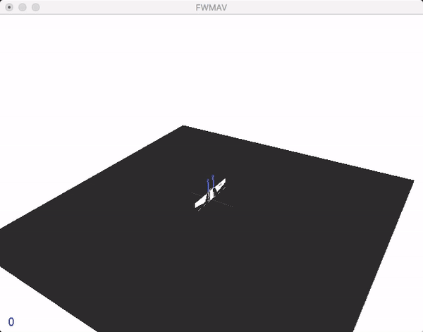

# Flappy

Flappy Hummingbird: An Open Source Dynamic Simulation of Flapping Wing Robots and Animals

This still work in progress. Full version will be released by May 20th 2019 and presented at ICRA2019.



## Publication

To cite this work in publications:

	@inproceedings{fei2019flappy,
	  title={Flappy Hummingbird: An Open Source Dynamic Simulation of Flapping Wing Robots and Animals},
	  author={Fei, Fan and Tu, Zhan and Yang, Yilun and Zhang, Jian and Deng, Xinyan},
	  booktitle={2019 IEEE International Conference on Robotics and Automation (ICRA)},
	  year={2019},
	  organization={IEEE}
	}

## Getting Started

These instructions will get you a copy of the project up and running on your local machine for development and testing purposes. See deployment for notes on how to deploy the project on a live system.

### Prerequisites

Flappy requires python3 with the development headers. You'll also need some other system packages. DART is required as simulation engine (and we use pydart2 as interface). They can be installed as follows

#### Ubuntu

```zsh
# install system packages
sudo apt-get update && sudo apt-get install cmake libopenmpi-dev python3-dev zlib1g-dev swig python3-pip python3-pyqt4 python3-pyqt4.qtopengl

# install dart
sudo apt-add-repository ppa:dartsim
sudo apt-get update
sudo apt-get install libdart6-all-dev
```

Please refer the [official DART installation document](https://github.com/dartsim/dart/wiki/Installation) when you have problems. 

#### Mac OS X(not finished)
Installation of system packages on Mac requires [Homebrew](https://brew.sh). With Homebrew installed, run the follwing:
```bash
# install system packages
brew install cmake openmpi

# install dart
brew install dartsim
```

### Virtual environment
From the general python package sanity perspective, it is a good idea to use virtual environments (virtualenvs) to make sure packages from different projects do not interfere with each other. Creation of virtual environments is done by executing the command [venv](https://docs.python.org/3/library/venv.html#module-venv):

```zsh
python3 -m venv /path/to/new/virtual/environment
```

To activate a venv:

```zsh
source /path/to/venv/bin/activate
```

### Installation
- Pydart2 is a python binding to DART. 

    ```zsh
    pip install pydart2
    ```
    Please refer to [document](https://pydart2.readthedocs.io/en/latest/install.html) when you have problems.

- [Tensorflow](https://github.com/tensorflow/tensorflow) is needed for the usage of neural network. If you want to make use of your GPU, please install the tensorflow with gpu

    ```zsh
    pip install tensorflow-gpu # if you have a CUDA-compatible gpu and proper drivers
    ```
    else
    ```zsh
    pip install tensorflow
    ```
    please refer to [TensorFlow installation guide](https://www.tensorflow.org/install/)
    for more details. 
  
- Clone the repo and cd into it:
    ```zsh
    https://github.com/purdue-biorobotics/flappy.git
    cd flappy
    ```
    
- Install Flappy package
    ```zsh
    pip install -e .
    ```

## Environments
### FWMAV
Dual motor driven flapping wing robots based on the Purdue Hummingbird robot.

The control of this vehicle is a difficult problem. We challenge developers, researchers, scientists and roboticists to come up with better control algorithms, either feedback controller or learning based controller.

Two default working controller are included: a cascading PID controller (control structure similar to ArduPilot) and an Adaptive Robust Controller (ARC). These two controller can be evaluated in the provided test script.

#### 'fwmav_hover-v0'
This environment is for controlling the dual wing flappin wing robot.

The inputs are the thrust and torque signals, namely voltage_amplitude_ for thrust, differential_voltage_ for roll torque, mean_voltage_ for pitch torque, and split_cycle_ for yaw torque. This mode of control is similar to helicopter or quadcopter control.

The input action is in [-1,1] and will be scaled to their approprate range. If implementing a feedback controleller, the input should be scaled to [-1,1]. See the baseline PID controller and test example for detail.

##### Testing with Closed loop controller (PID or ARC)
```zsh
python test.py --model_type=PID
python test.py --model_type=ARC
```

##### Learning
We choose to use stable baselines instead of baselines as our RL library. Note that our environment still follow the specification of gym/env, so baselines can be applied to our env as well.

###### Training
```zsh
python train.py --model_type=PPO2 --model_path=ppo2_mlp --policy_type=MlpPolicy --n_cpu=12 --time_step=100000
```

###### Testing with trained model
```zsh
python test.py --model_type=PPO2 --model_path=ppo2_mlp --policy_type=MlpPolicy
```

#### 'fwmav_hover-v1'
This environment is for controlling the dual wing flappin wing robot.

In this case, the inputs are just two voltage signals supplied to the two motor. The control policy should try to generate sinusoidal signals near 34Hz to drive the wings and implement control at the same time. Without specifiing the wing kinematics allows the ability to generate torque and force in arbitrary directions.


## Contributor
Fan Fei, Ruoyu Wu, Jian Zhang

## License
MIT

## Acknowledments

